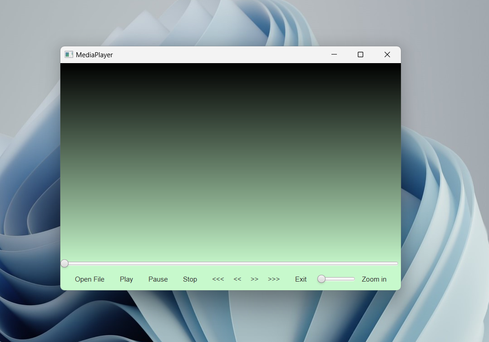
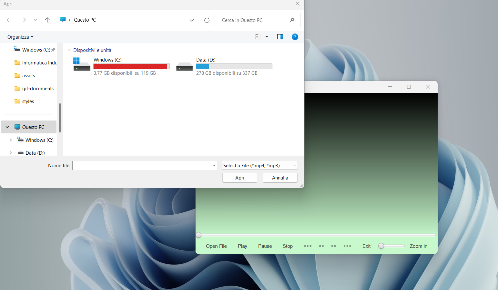
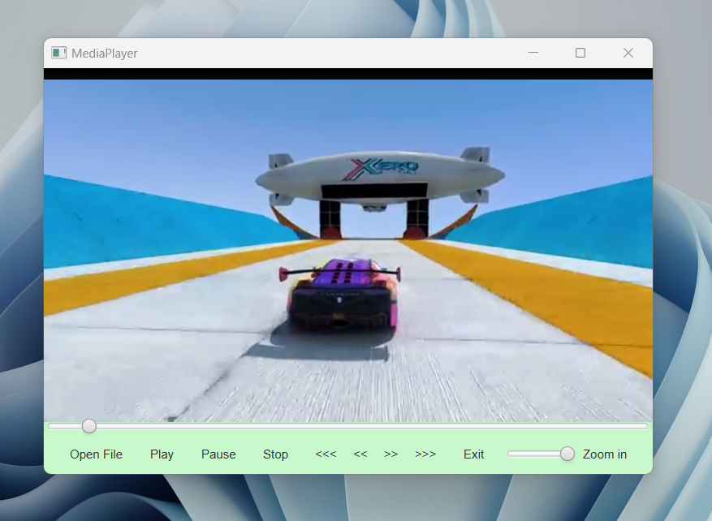

# FH_MediaPlayer:

☢️☢️☢️ ***Disclaimer:*** ☢️☢️☢️ 

***This app is far away to be perfect, it's possible that it has a lot of bugs or inaccuracies. I do not take any responsibility for the possible corruptions of your files.***

## Description:

FH_MediaPlayer is a simple tool to reproduce audios and videos from your gallery. It's my personal project for the Tesina of 'Ingegneria del Software' course and its purpose is to be a way for me to learn and play
with some JavaFX tools, and apply general Software Engineering rules.

This project aims to be extensible and modifiable according to the main rules of the Software Engineering. If you want to take a closer look of these concepts or you just want to understand how this app works, I recommend you to read my personal Tesina, you can find it in the ***tesina*** folder.

## General view:

***Presentation:***

***Access to your Gallery:***

***Just Play:***

## Download:
You can download FH_MediaPlayer in the ***release*** folder, where you can find the jar file. You need to have the Java 17 or above to run it.

If you want to use the CLI interface to run it, you need to run this command line:

`java -jar FH_MediaPlayer-1.0.jar`
